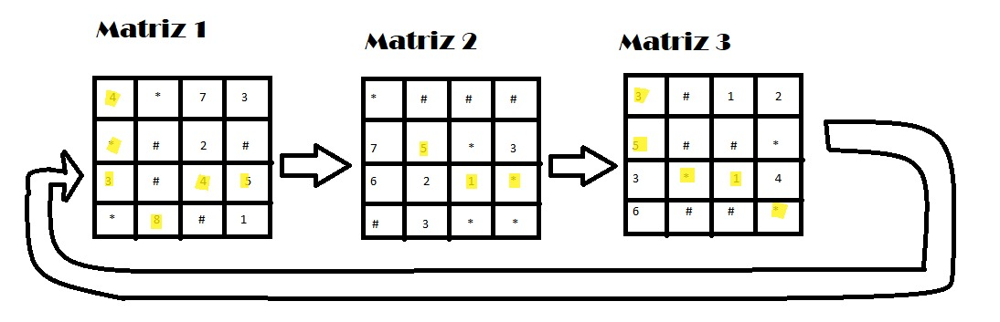
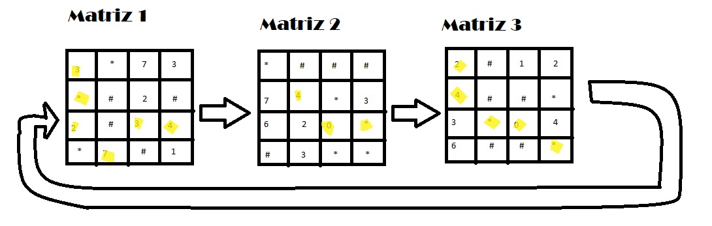
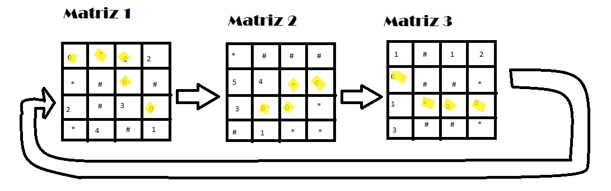
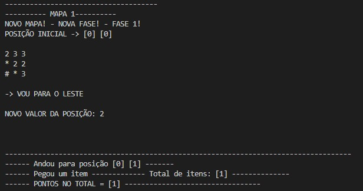
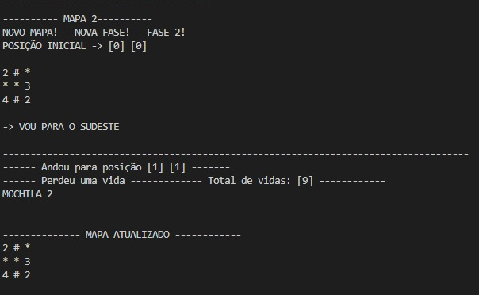
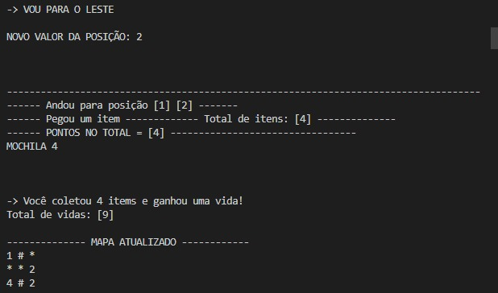
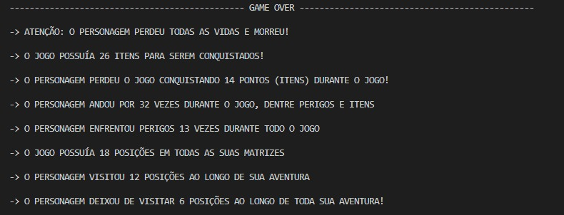

# LabirintoRecorrente
AEDS I | CEFET-MG

 
 
</a> 

 

 

	O trabalho "Labirinto Recorrente" se baseia em um jogo automático e totalmente randômico. Ele consiste, basicamente, em um caminho, composto de matrizes (mapas) quadráticas, que um personagem deve atravessá-las, podendo enfrentar casas com itens (que posteriormente podem lhe gerar vidas), perigos (que tiram-lhe uma vida) ou paredes (que são impossíveis de serem atravessadas). O objetivo do personagem é, através de passos totalmente randômicos, fazer um caminho que passe por todas as matrizes possíveis, caindo em posições com zero itens, sem perder todas as vidas, chegando então à vitória! Caso contrário, o personagem perde todas as vidas e morre, assim, perdendo o jogo!

	Como qualquer jogo, ele também possui algumas regras:
  

    
  
      &emsp; - Para ganhar, o personagem deve passar por todas as matrizes e voltar para a matriz inicial sem morrer e fazer todo esse caminho sem adiquirir nenhum item. 
    

    

      &emsp; - Para perder, basicamente, ele deve perder todas as vidas. Ele perde vida passando por perigos (representados pelos "*" pela matriz). Caso ele seja randomizado em uma posição inicial em que existam apenas paredes em volta dele, ele também irá morrer, pois não terá para onde ir.
      

      

      &emsp; - Ao passar por uma casa com itens (casa com um número), o personagem pega um item e o número contido na posição diminui em uma unidade. Caso ele atinja uma casa com número zero, ele não pegará itens nessa posição.
      

      

      &emsp; - Ao atingir 4 itens, o personagem ganha uma vida e zera novamente a contagem de itens.
      

      

      &emsp; - O personagem inicia o jogo com 0 itens e 10 vidas.
      

      

      &emsp; - O "teletransporte" entre as matrizes é feito quando o personagem atinge a última coluna da matriz que ele está posicionado. Caso isso aconteça, seu próximo movimento será na matriz seguinte e sua posição nela será totalmente randômica.
      

      

      &emsp; - O personagem não pode voltar alguma matriz, ou seja, uma vez que ele passou por uma matriz, só retornará nela caso dê uma volta completa por todo o percursso do jogo.
      

      

      &emsp; - A mudança de matriz sempre é em sentido crescente, ou seja, da 1 para a 2, da 2 para a 3, assim sucessivamente.
      

      

      &emsp; - Quando alcançar a última coluna da última matriz, o personagem irá retornar para a matriz de número 1 e iniciará um "novo ciclo" no jogo.
      

   

  Um exemplo de "ciclo" de percursso do personagem pode ser visto na imagem abaixo:

 

   A partir dessas movimentações do personagem é possível observar que ele conquistou 10 itens no total, ou seja, conseguiu 2 vidas e ainda tem 2 itens em sua "mochila". Entretanto, ele passou por 4 perigos, perdendo assim 4 vidas. Portanto, o personagem terminou seu primeiro "ciclo" com 8 vidas e 2 itens na "mochila".

   No início do seu "segundo ciclo", as matrizes iriam ser inicializadas da seguinte forma:

 

  É possível observar que, os caminhos com itens que o personagem passou, tiveram um decréscimo em seus valores de uma unidade, ou seja, cada posição passou a ter um item a menos. 

  É possível observar também que, caminhos que não têm mais itens, tem seu valor setado como "0", ou seja, não são caminhos perigosos, porém também não dão itens ao personagem. Essas posições zeradas ajudam o personagem a ganhar o jogo, já que para ganhar ele deve fazer um percursso todo sem pegar itens.

Uma possível vitória pode ser observada na imagem abaixo:

 

É possível observar que o caminho percorrido pelo personagem em todas as matrizes não o fez conquistar nenhum item. Ele só passou por posições zeradas ou com perigos. Caso ele consiga um caminho como esse e não perca todas as suas vidas, ele ganha o jogo!

 
 

==========================================================================================

 
 

	O algorítimo foi separado em funções. As três primeiras funções presentes no arquivo .hpp servem para randomizar um número pré estabelecido de matrizes e imprimí-las no arquivo .data. As demais funções servem para o funcionamento do jogo e coordenação do personagem entre as matrizes.

	Partindo para o funcionamento do jogo, as quatro últimas funções apresentadas no arquivo .hpp são as responsáveis. Inicialmente, a função "Ler Matriz" faz a leitura das matrizes criadas à partir da randomização, criando o arquivo "input.data". Após isso, a função chamada "EscreverMatriz" separa cada matriz em um arquivo .data separado, para fazer a leitura de cada matriz individualmente, economizando assim, espaço de memória. A função "EscreverMatriz" também é responsável pelo armazenamento do nome dos arquivos na struct que trabalha com a demarcação das posições já buscadas pelo personagem, para fazer a verificação de quantas casas foram exploradas por ele.

	A função responsável pelo funcionamento do jogo, de forma principal, é a chamada "PercorrerMatriz". Em primeiro lugar, ela irá verificar em qual matriz o personagem está localizado. Caso ele esteja iniciando o jogo naquele momento ou efetuando seu primeiro passo após um teletransporte, essa função irá randomizar uma posição inicial para o personagem (essa posição não pode ser um perigo e nem uma parede).

	Caso o personagem já esteja inserido em um novo mapa (matriz), ele irá partir para sua movimentação aleatória. Tal processo se dá em uma randomização de um número de 1 a 8, cada número corresponde à uma possível direção que o personagem irá avançar. 

	Exemplo: A randomização apresentou o número 3, logo o personagem irá se dirigir ao leste. Caso a posição ao leste tenha um número, o personagem irá ganhar um item!

	Quando o personagem atingir a última coluna da matriz atual, seu próximo movimento irá ser na matriz seguinte. O terminal irá exibir o novo mapa a ser explorado com a mensagem informado de qual matriz o personagem irá se localizar.

	Caso a posição randomizada tiver um perigo, o personagem irá perder uma vida!

	Ao adiquirir 4 itens, o personagem os troca por uma vida!

	Existem duas condições de finalização de jogo, com a derrota ou com a vitória.

	Em caso de derrota, o personagem terá perdido todas as vidas e o terminal irá exibir a mensagem abaixo com as informações da aventura do personagem:  

	Já em caso de vitória, o personagme terá que ter feito o caminho proposto nas regras acima. Então, o terminal irá exibir a seguinte mensagem com as informações da batalha que acabara de ser vencida:

